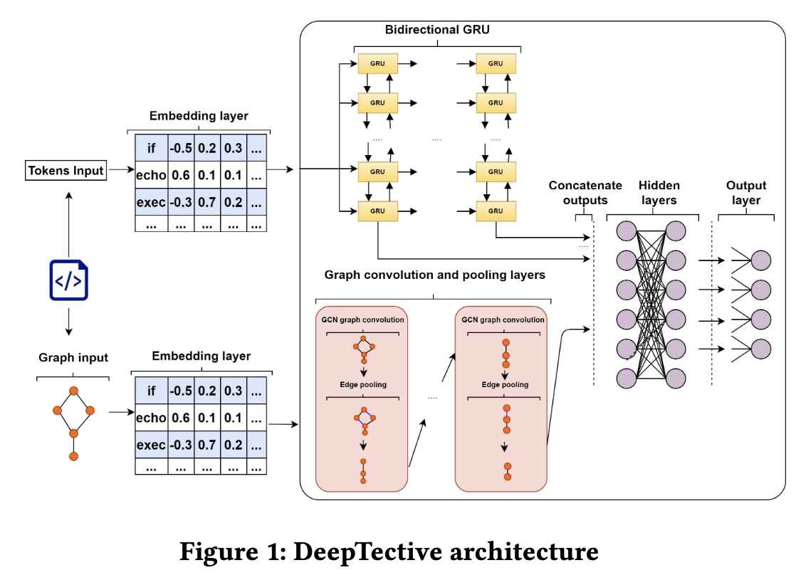

# DeepTective
A Hybrid Graph Neural Network Approach for Detecting PHP Vulnerabilities



## Description

This is a repo of the code used for detecting vulnerabilities in php source code.  
Namely XSS, SQLi and Command Injection.  

Data and data related preprocessing can all be found in the data/ directory  

Running ML training can be found in the root directory. Our best model was the combined lstm + cfg which is saved as `model_combine.pt`.  
You can run this on your own code by running run_model.py.  
You will have to change the directory variable to point to the directory of the code.  

Note that in main_graph_cfg_or_pdg.py, the default is running cfg.  
To train on pdg data, you will have to change the names of the pickle files at the top of the file to the relevant one.  

## Data

Before running anything, please unzip `all_data.zip` first!  
  
`wget --no-check-certificate -O all_data.zip "https://onedrive.live.com/download?cid=15E206B36A9C8AE7&resid=15E206B36A9C8AE7%21300809&authkey=AECPe5YU26hRj_g"`  

In the data directory, each file generates a certain type.  
Below is the prefix of the file along with the data it generates.  
The * symbol is one of SARD, NVD or GIT:  

 * prepare_dataset_*.py - Sequence of tokens
 * prepare_graph_dataset_*.py - Control Flow Graphs
 * prepare_dependence_graph_dataset_*.py - Program Dependence Graphs
 * prepare_AST_dataset_*.py - Abstract Syntax Trees


## Models

Before running any scripts. please unzip `all_models.zip` first!  
  
`wget --no-check-certificate -O all_models.zip "https://onedrive.live.com/download?cid=15E206B36A9C8AE7&resid=15E206B36A9C8AE7%21300810&authkey=AJuxUdOyJDxdtp4"`  
  
Unzip all files into the `root` directory.  
3 models will be extracted:  

* model_fileA.pt  
* model_funcA.pt  
* model_combine.pt  
  

## File-level

* To train at file-level, use `main_graph_combine_fileLevel.py`
* To use the pretrained model, `model_fileA.pt` for evaluation, please use the `main_graph_combine_fileLevel(eval).py` and set the dataset name inside the script.


## Citation

Accepted as conference paper (oral presentation) at the IEEE Conference on Dependable and Secure Computing (DSC) 2022.
Link to paper: https://ieeexplore.ieee.org/document/9888816

If you refer to our work, please cite our paper as below:  

```bibtex
@INPROCEEDINGS{rabheru2021deeptective,

  author={Rabheru, Rishi and Hanif, Hazim and Maffeis, Sergio},
  booktitle={2022 IEEE Conference on Dependable and Secure Computing (DSC)}, 
  title = {DeepTective: Detection of PHP Vulnerabilities Using Hybrid Graph Neural Networks},
  year={2022},
  volume={},
  number={},
  pages={1-8},
  doi={10.1109/DSC54232.2022.9888816}
  
}
```
